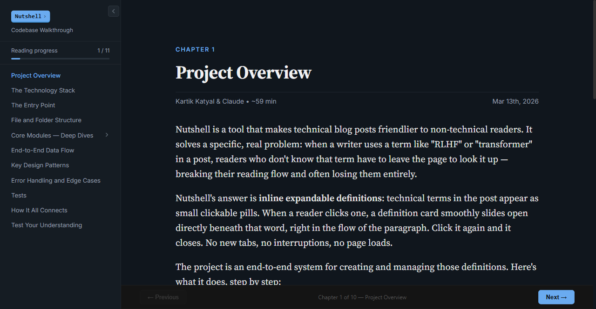
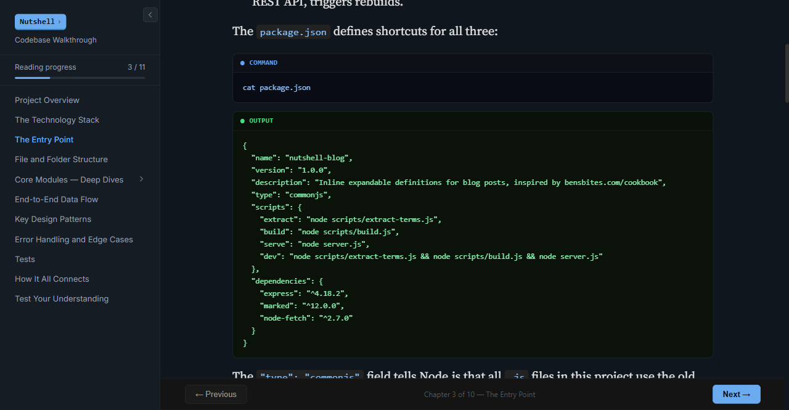
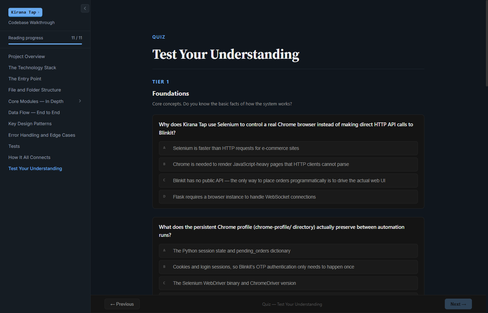

# Walkthrough

A [Claude Code](https://docs.anthropic.com/en/docs/claude-code) skill that generates a deep, honest technical walkthrough of any codebase — then renders it into an interactive HTML reader you can open in your browser.

Built for people who use AI coding agents to build things and want to actually understand what got built. Not a summary. Not generated docs. A real walkthrough that treats you as smart, uses the real vocabulary, and shows you the actual code.

Here's a walkthrough of [Kirana Tap](https://github.com/Kartik0110-lgtm/Kirana-Tap-2), generated entirely by this skill:







## Key Features

- **Real Code, Not Paraphrases** — Every code block is captured by running a command against the actual repo using [showboat](https://pypi.org/project/showboat/), a CLI tool for building executable documents. Nothing is invented or copy-pasted.
- **10-Chapter Structure** — Project overview, tech stack, entry point, file structure, core modules, data flow, design patterns, error handling, tests, and a closing mental model that ties it all together.
- **Editorial Callouts** — Each chapter gets an insight or pattern callout that names something the reader absorbed but didn't consciously notice. "Defensive Automation", "Pipeline with Side-Channel Updates" — giving patterns a name makes them transferable.
- **Project-Specific Quiz** — 6 multiple-choice questions testing architectural intuition + 4 design-thinking scenarios with collapsible answers. Every question is written specifically for the codebase being walked through.
- **Self-Contained Reader** — The output is a single HTML file with dark theme, sidebar navigation, reading progress tracking, and confetti on a perfect quiz score. No build tools, no dependencies.

## Installation

```bash
git clone https://github.com/Kartik0110-lgtm/walkthrough.git
cp -r walkthrough/walkthrough ~/.claude/skills/walkthrough
cp -r walkthrough/walkthrough-render ~/.claude/skills/walkthrough-render
```

Or symlink if you want to pull updates later:

```bash
git clone https://github.com/Kartik0110-lgtm/walkthrough.git ~/walkthrough-skills
ln -s ~/walkthrough-skills/walkthrough ~/.claude/skills/walkthrough
ln -s ~/walkthrough-skills/walkthrough-render ~/.claude/skills/walkthrough-render
```

Restart Claude Code. You should see `/walkthrough` and `/walkthrough-render` when you type `/`.

## Usage

### Step 1: Generate the walkthrough

Navigate to any project directory and run:

```
/walkthrough
```

This explores the codebase and writes `WALKTHROUGH.md` — a comprehensive technical document with real code snippets captured from the repo.

You can optionally focus on a specific area:

```
/walkthrough "focus on the authentication system"
```

### Step 2: Render the reader

```
/walkthrough-render
```

This reads `WALKTHROUGH.md`, injects it into the HTML reader template with chapter definitions, editorial callouts, and a custom quiz, validates the output, and opens it in your browser.

## Architecture

| File | Purpose |
|------|---------|
| `walkthrough/SKILL.md` | Explores the codebase and generates `WALKTHROUGH.md` using showboat |
| `walkthrough-render/SKILL.md` | Renders the markdown into an interactive HTML reader |
| `walkthrough-render/template.html` | The HTML reader template with `%%PLACEHOLDER%%` injection points |

The render phase generates a Node.js build script that handles `<script>` tag escaping (walkthroughs of web projects contain HTML that breaks the parser), `safeReplace()` for placeholder injection (avoids `$`-substitution bugs), and three-part validation before opening the browser.

## Philosophy

This skill exists because of a gap: you can use AI agents to build ambitious software, but the result is a codebase you don't fully understand. Reading the code file by file doesn't give you the mental model. Generated docs are too shallow. What you actually need is someone to sit down and walk you through it — explain the why behind every decision, show you the real code, and test whether you actually got it.

That's what this does. The reader is written for someone who is smart and curious, not technical yet but actively trying to be. It uses the real vocabulary — "closure", "middleware", "decorator stack" — and explains each term properly the first time. The goal is that after reading, you've learned something real and durable, not just got a vague feel for things.

## Requirements

- [Claude Code](https://docs.anthropic.com/en/docs/claude-code) CLI
- [showboat](https://pypi.org/project/showboat/) — `uv tool install showboat` or `pip install showboat`
- Node.js (for the render build script)

## Credits

Created by [@Kartik0110-lgtm](https://github.com/Kartik0110-lgtm) with Claude Code.

## License

MIT — Use it, modify it, share it.
